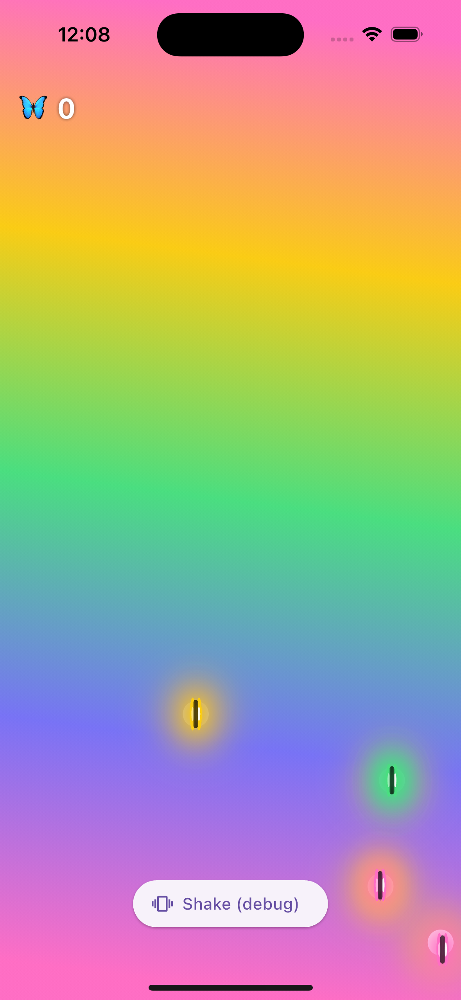

# Flutter 🦋

An ambient acid-trip toy: glowing neon butterflies drift across a swirling
tie-dye background and settle on glowing flowers. Tap to catch them, shake for
chaos. Built with [Flame](https://flame-engine.org/).

<p align="center">
  
</p>

## Run

```bash
make run      # boots the iOS Simulator + flutter run
make test     # 19 unit/widget tests
make analyze  # flutter analyze (clean)
```

`flutter not found`? → `export PATH="/opt/homebrew/bin:$PATH"`.

In-app: `r` hot reload · `R` hot restart · `q` quit.

## Interactions

- **Tap** a butterfly → catch it, the 🦋 counter ticks up, a new one fades in.
- **Shake** → butterflies scatter, new flowers bloom, the whole palette shifts hue.
  The Simulator has no accelerometer, so use the **Shake (debug)** button; a real
  shake works on a physical device.

## Layout

```
lib/
  main.dart                  app entry: GameWidget + HUD overlay + shake detector
  game/
    flutter_game.dart        FlameGame: state, counter, scatter/bloom/shiftPalette
    butterfly.dart           steering, flap, glow, tap-to-catch
    flower.dart              bloom-in glow, attractor
    tie_dye_background.dart  animated swirling gradient
    motion.dart              pure steering math (seek/scatter/clamp/wander)
    palette.dart             tie-dye colors + hue shift
  input/shake_detector.dart  accelerometer → onShake (with debounce)
  ui/hud.dart                caught counter + debug shake button
```

Motion and palette math are pure functions, so most logic is unit-tested
without the engine.
